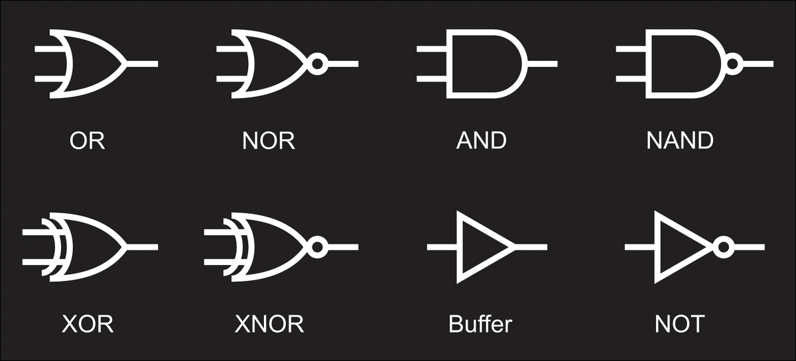
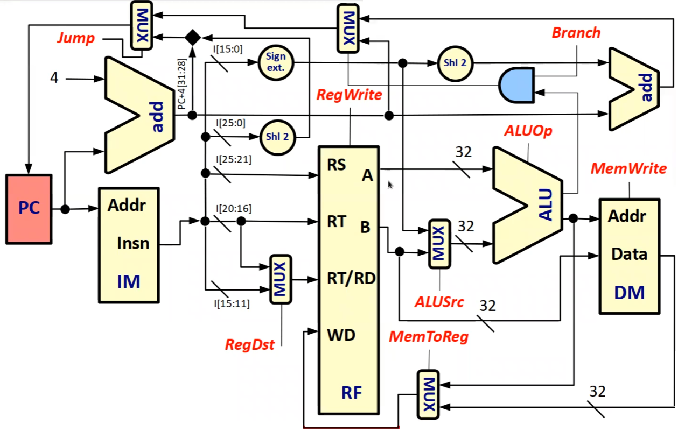
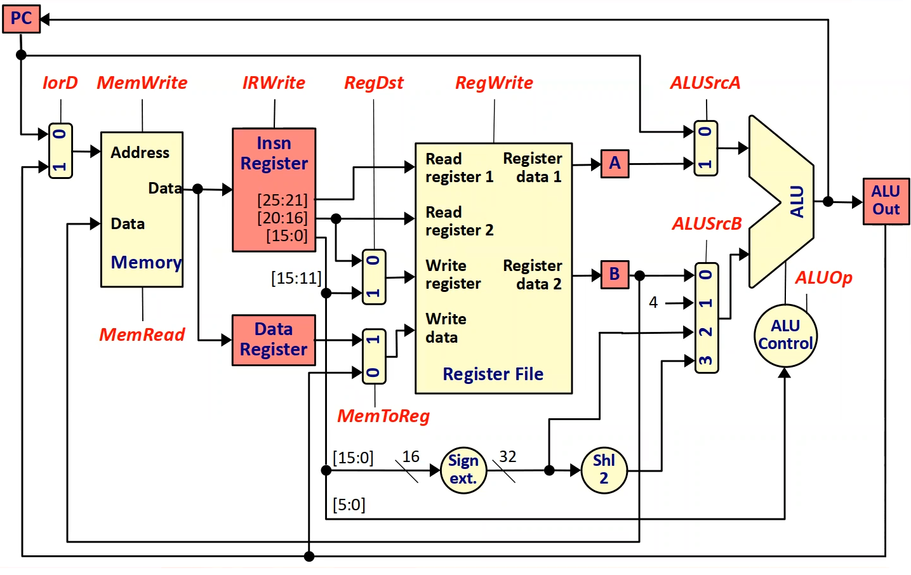
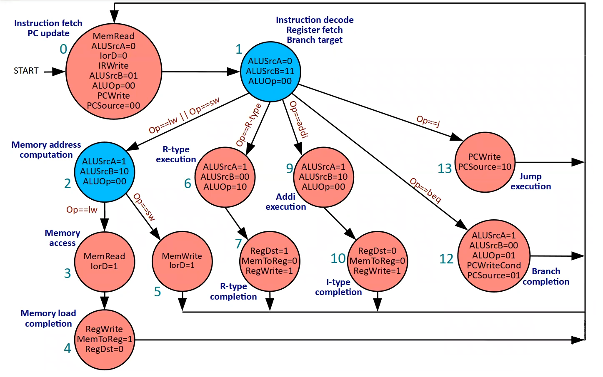
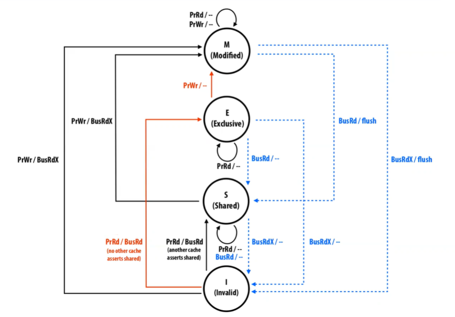

# Architektura počítačů

[Stránka 1](https://d3s.mff.cuni.cz/teaching/nswi143/), [Stránka 2](https://d3s.mff.cuni.cz/legacy/teaching/computer_architecture/), [Záznamy](https://cunicz.sharepoint.com/:f:/s/d3s-teaching/EmarrFhUHvJNn64sxL9lyV0BJk8q6uIzTEE-fKzFxVqkDQ)

> 1. Přednáška

## Úvod

**Tranzistor** - vypínač řízený signálem
**Integrovaný obvod** - spojení tranzistorů

Volatilní paměť - **DRAM** a **SRAM** (nepotřebuje refresh a je rychlejší)
Sekundární paměť - **HDD** a **SSD**

Vstup, výstup, ...

Obří rozsah programů...
**Abstrakce** - vrstvy od uživatele přes algoritmus až po strojový kód

> 2. Přednáška

## Výkon

**Moorův zákon** - zmenšování tranzistorů pro CPU, kapacita DRAM...
Výkon je ovlivňován *algoritmy, programovacími jazyky, kompilátorem, architekturou, CPU, pamětí, I/O, ...*

**Měření výkonu** na základě `execution time` a `throughput` (záleží na požadovaném využití)
$$
\text{Peformance} = \frac{1}{\text{Execution time}}
$$
Rozdíl mezi `wall-clock time` a `processor time` (uživatel a CPU)
$$
\text{CPU execution time} = \frac{\text{CPU clock cycles}}{\text{CPU clock rate}} 
\\
\\
\text{CPU clock cycles} = \text{CPI}^* \times \text{Number of instructions}
$$

$^*\text{CPI} := \text{Clock cycles per instruction}$ 

> Jak výše zmíněné (algoritmy...) ovlivňují počet instrukcí, CPI a takt?...

> Příklad se zlepšování části programu... později Amdahl

Číslo $\text{MIPS} := \text{Million pnstructions per second}$ je ne vždy použitelné (různé instrukce)
Lepší měření pomocí exeucition time pro konkrétní workload - **SPEC**

Problém kolem 2004 s dodáváním a odváděním energie - **snížení napětí **(ale problém rozpoznání 0 a 1)

**Paralelismus** nezlepší sekvenční program, paralelizování je náročné 

> Konkrétní problémy... nepřehledné, overhead, rozložení práce

**Amdahlův zákon** o zrychlení celku po zlepšení pouze části

Pro paralelismus je $n \in \mathbb{N}$ je počet jader a $B \in \langle 0,1\rangle$ je práce, která nejde paralelizovat
$$
\text{Speedup}(n) = \frac{1}{B + \frac{1}{n} (1 - B)}
$$
Říká nám, že později zvyšování počtu jader je stále méně efektivní

*Bývají různé algoritmy pro určitý počet jader*

**Make common case fast**...

> 3. Přednáška

## Logické obvody

### Úvod

High level voltage (logická jedna)
Low level voltage (logická dva)

**Logická funkce** ($f: B^k \rightarrow B$) je daná tabulkou

Booleovská algebra...
Univerzální jsou `NAND`, případně `NOR`

**Logické bloky** jsou nějaké černé skříňky, které vykonávají funkci (vrstvíme bloky)

* **Kombinační** - bezstavové, reprezentují logické funkce
* **Sekvenční** - má paměť, interní stav, sekvence kroků

CPU počítá po **slovech**, umí logicky posouvat, ...

### Značení hradel

*Jednotlivá implementace hradla má vliv na elektrické vlastnosti - především spotřeba*

CMOS logika se snaží o to, aby nikde netekl proud, důležité je napětí (velká dynamická spotřeba ale)

### Binární sčítačka

Půl sčítačka - výsledek `a XOR b` a carry  `a AND b`
Úplná - dvě půlsčítačky a jeden `OR` na carry

$n$-bitovou složíme z několika úplných

Pokročilejší verze viz. ADS 2

> 4. Přednáška

### Binární odčítačka

Využijeme `dvojkový komplement` - invertujeme vstup přes `XOR` a sečteme

## Sekvenční obvody

*Kombinační logika a vnitřní stav*

Synchronní a asynchronní obvody (podle toho kdy se mění stav)
**Hodinový signál** (rostoucí a klesací hrana) - dělá se v tu chvíli snapshot

Mívají `paměťový prvek` - ukládání např. **R-S latch** pomocí 2 zacyklených `NOT` či `NAND`
V praxi se blokuje do hodinového signálu a je i master a slave verze

Dále můžeme mít **J-K**, který umí flipovat, **D** s intuitivním vstupem a **T**...

**Datový registr** z několika D
Možné pak easily vytvořit posuvný registr pro shiftování

Je možné udělat pomalou násobičku a děličku pomocí sčítání a shiftování...

## MIPS úvod

* 32 bitových **registrů**
* **Program counter** s adresou instrukce

Přístup do paměti zarovnané na 4B

* Aritmetické a logické operace (ortogonální neboli A  = B + C)
* Load/store instrukce
* Podmínky
* Nepodmíněné skoky
* Speciální instrukce

Jeden univerzálně dlouhý cyklus **single-cycle datapath**
Kvůli tomu nemůžou být instrukce pro násobení a dělení (moc dlouhé)

Krok jednoho cyklu:

1. Fetch instrukce
2. Dekódování instrukce a fetchnutí operandů
3. Vykonání operace podle op-kódu
4. Uložení výsledku operace
5. Inkrementace program counter (buď +4 (vždycky 4 byty) nebo podle JUMP či BRANCH instrukce)

> Ukázka pro opakovaný inkrement PC na tik

Je potřeba switch pro rozseknutí instrukce z paměti

> 5. Přednáška

Ke všem komponentům je potřeba přivést napájení a často se vedou i globální hodiny

**Register file** - blok, který mi vrátí hodnotu v určitém registru...

**R-Formát instrukce**: `OP (6)`, `RS (5)`, `RT (5)`, `RD (5)`, `SA (5)`, `FUNCT (6)`, kde
$$
\text{RD} \leftarrow \text{RS}\ \boxed{FUNCT}\ \text{RT}
$$
Podle op kódu tedy určíme i co nás zajímá ze zbytku

**Registrová banka** - především nám po zadání adresy vrátí to, co registr obsahuje

`r0` má write protect - čte se z něj vždy nula

**Multiplexor** umožní vybrat si hodnotu ze správného vstupu
**Dekodér** nám posílá nastavený bit jenom na jednom výstupu

**ALU jednotka** (aritmeticko-logická) - složena z ALU nižších řádů, op kódem určíme operaci

**I-formát**:  `OP (6)`, `RS (5)`, `RT (5)`, `IMMEDIATE (16)` 
Formát pro aritmetiku a podmíněné skoky do paměti (je tam realtivní `DISPLACEMENT (16)`...)

`IMM` se znaménkově rozšiřuje na 32b - to jde udělat triviálně drátky

Offset pro skoky je v počtu instrukcí a ne bitech...
Nepodmíněný skok je snazší - přilepím první 4b k 26b (+ 2b) z instrukce

> 6. Přednáška

Rozdělení na **datapath** a **řadič**

Řadič je řízený op kódem - dá nám nějaké slovo a to pak rozdělím do datapath

Dvě verze řadiče: 

* ROM - standardní (snazší, ale pomalejší), obsahuje `control words` 
* Kombinační obvod - simulace ROM

**Continous read** - read instruction, read registers, read data memory, write to data memory, write to registers, write to pc

V realitě nemusíme kvůli takt až tolik zpomalovat, protože mám procesorové cache a čtení je asynchronní

Nejdelší instrukce v našem MIPSu je load word
*Jak náš procesor zrychlit?*

Potřebuji proměnný počet tiknutí na jednu instrukci

> 7. Přednáška

## Multi-cycle datapath

* Musíme mít sekvenční řadič
* Spojíme dvě paměti do jedné (v jedné fázi čteme instrukci a v jiné data)
* Mám registry uvnitř datapath na pamatování mezivýpočtů

#### Průběh (fáze)

1. Načtení instrukce, inkrement `PC`
2. Načtení registru, vypočítaní branch target
3. Operace `branch` a `jump` skáčou a končí, výpočet v ALU pro všechny ostatní
4. Operace `memory read` čte z pamětí, vše ostatní zápis a konec
5. Zápis přečtených dat do registru

### Sekvenční řadič

Konečný automat, který se podle op kódu instrukce rozskakuje

Budu mít větve: memory op (read/write), register op, branch, jump, add-i, undefined

Ještě v tom diagramu ale chybí

### Výjimky

Neočekávaný tok program - neplatná instrukce, aritmetické přetečení, ... , externí interrupt

Je potřeba přestat instrukci vykonávat (ale zároveň zachovat validní stav procesoru), uložit adresu operace, která chybu způsobila a skočit na **exception/interrupt handler**

V MIPSu se skáče na jeden handler, Intel má tabulku...

Softwarový handler - uloží současný stav CPU do paměti, ... , obnoví stav, skočí zpět

Dnes se ale stejně používá pipelinening a v každém taktu se dokončí jedna instrukce

> 8. Přednáška

### Implementace řadiče

Řadič musí mít stav a op kód - z toho generuje potřebné příznaky a next-state
Využíváme k tomu buď ROM a nebo kombinační obvod (obvodový řadič)

Pro přecházení mezi stavy máme **Address select logic block**
Ten dostane adress controll z hlavního bloku a op kód
Obsahuje Dispatch ROM (či obvod) pro rozhodování kam dál

Výhody ROM může být například flashnutí nové verze

**Horizontální mikroinstrukce**

ROMka je dost velká na to, aby v ní bylo libovolné controll word.
Nevýhodou je, že mnohé controll words nejsou pro nás užitečná.

**Vertikální mikroinstrukce**

ROMka je tak akorát velká na to, aby se do ní vešly controll words, která nás zajímají. 
Musíme je ale zakódovat, což znamená, že pak procesor musí trávit čas...

**Nanokód** - ještě větší úspora místa pomocí extra tabulky

> 9. Přednáška

## Pipelining

Zvýšíme propustnost - budeme paralelně vykonávat instrukce *(Překryjeme latenci)*
Nejpomalejší fáze určí délku jednoho kroku - proto se pomalejší fáze rozdělují

Návrh založíme na single-cycle a přidáme registry

**Klasické fáze**: fetch, decode, exceute, memory access, write back

Potřebuji registry pro přechody mezi fázemi - například si pamatovat instrukci
Hodí se i více sčítaček

**Skalární procesor** - v každé fázi jedna instrukce
**Superskalární procesor** - potenciálně i víc

**In-order** - instrukce nepředbíhají
**Out-of-order** - instrukce se plánují

**Pipeline depth** - počet kroků

Řešení výjimek pomocí propagace přes registry, nejdříve tu nejdál, flushnu zbytek...

*Jak to řídit?* Stejně jako single-cycle a budeme šířit řídící signály

**Zjednodušení návrhu**

* Hodí se mít stejně dlouhé instrukce
* Málo instrukčních formátů, fixní pozice zdrojových registrů
* Paměťové operandy jen v loadech a storech
* Zarovnané operandy

### Hazard

Některé instrukce jsou na sobě závislé, musíme tedy čekat
Už jenom kvůli tomu se nedostaneme na CPI 1

*Původně to měl řešit překladač, ale efektivnější je to u procesoru* - safe pipeline

> 10. Přednáška

Pro automatickou detekci je potřeba **hazard unit**, která injectuje stall 

#### Data hazard

*Ještě nejsou zapsaná potřebná data*

Efektivně se řeší pomocí **forwarding unit** - využití hodnoty již z pipeline
Musí být v každé fázi

To ale nemůžu použít třeba u load/use dependency - čtení z paměti

#### Control hazard

*Ještě nejsem rozhodnutý, zda instrukce vykonám*

V první řadě urychlím rozhodování ALU jednotkou navíc a zbývá mi jen
**Delay slot** - Za branch se vykoná jedna instrukce navíc (it's a feature not a bug)

*Co ale s dalšími instrukcemi v pipeline?* Prostě je nechám běžet, lepší to pak zahodit než stallovat - statické vs dynamická predikce **branch predikce**

Dynamické jsou založené na tom, že se dívám, jestli jsem minule skákal (**predictor**)
Můžu to ještě vylepšit, když o tom budu mít dvou bitovou informaci - případně budu mít rovnou tabulku ke skokům z adres (**branch history table**)

> 11. Přednáška

**Flynnův bottleneck** - maximálně to stáhnu na CPI = 1... spíš ale horší

## Superskalární pipeline

Máme více pipeline najednou - dnes běžně 4

Kompilátor hledá nezávislé proudy instrukcí (hodí se i pro skalární)
Reálně spíš **simulatenous multi-threading** - vykonání instrukcí z jiných programů

SMT se single pipeline může být fine-grained a coarse-grained

Problém se schedulováním kompilátoru - kompilátor nemá dostatek informací

**Multiple-issue** je něco jako superskalární...

### Static multiple issue

*Instrukce jsou rozřazeny do více proudů*

Např. jeden slot pro paměťové operace a druhý slot pro zbytek je relativně náročné...

MIPS - 64b instrukce, nepoužitý slot může dostat `NOP`, ale horší latence

Příklad s přičítáním k poli, dva sloty jsou téměř k ničemu bez **loop unrolling**
**Register renaming** - kompilátor musí přejmenovat registry při přerovnávání

Příklady: Very Long Instruction Word a Explicit Paralel Instruction Computer (Itanium se 128 registry)

### Dynamic multiple issue

Často velmi spekulativní - vysoká spotřeba i na zahozené instrukce

> Zajímavost o specter...

#### Out of order execution

Pozor na různé dependencies (WAW, RAW, WAR)
WAW a WAR zvládnu přejmenováním registrů

Zapsat výsledky ve správném pořadí - **Commit unit**

Náročné zjistit jaká instrukce může za výjimku - musíme zjistit, jestli by ještě něco nevyhodilo výjimku už před tím (přesné x nepřesné výjimky)

Frontend, rozbití jádra na atomické instrukce, execution, memory subsystem

*Příklad na Pentium a Skylake...*

Uvnitř všech procesorů je schovaný RISC...

> 12. Přednáška

## Paměť

Volba (2 ze 3) - rychlá, velká kapacita, cena

**Memory wall** (výkon CPU je omezen pamětí) - řešení *časová a prostorová lokalita*

Opět optimalizujeme common case a to, že to jde úmyslně pokazit nám je jedno

### SRAM

Priorita je rychlost, pak kapacita
Obvykle 6 tranzistorů na bit (jsou potřeba invertory jinak 9)
Nemusí refreshovat - proto statická

Maticové uspořádání
Řádek přes dekodér adresuje slovo, sloupec adresuje bit slova - `Bit line`, `word line`

Potřebuji možnost zapsat a povolit/zákazat vstup a výstup

### DRAM

Priorita je nízká cena za kapacitu
Kondenzátor s řídícím tranzistorem
Musíme refreshovat

Destruktivní čtení s vyrovnáním kapacity (bit-line na polovinu a pak zesílím)

Pomalé je tedy kvůli tomu, že musím zapsat zpět a čekám na přelití náboje

### Hierarchie pamětí

*Kompilátor* se stará o data v registrech a L1
*CPU* se stará o data z L1, L2 a RAM
*OS* se stará o data z RAM a disku

U RAM není žádný mechanismus pro miss

> 13. Přednáška

## Cache

> (Příklad ze 14.) radix sort je rychlejší než quick-sort, akorát že vůbec...

Snažíme se o iluzi velké a rychlé paměti
Při dotazu může nastat **hit** nebo **miss**

Obvs. vzoreček $LAT_{AVG} = LAT_{HIT} + (LAT_{MISS} \cdot PERC_{MISS})$

**L1** - má oddělenou instrukční a data cache (kvůli různým přístupům)
**L2** - stále ideálně umístěná na čipu
**L3** - je sdílená pro všechny procesy

**Cache controller** - umožní nám čtení a zápis do cache

**Cache lines** - získáme je pak pomocí hardwarové hashovací tabulky
My jsme si ukazovali jenom využití spodních bitů adresy

*Jak se postarat o correct data?* **Tag** - musím vědět ze které adresy je první line
Dále potřebujeme bit, jestli data jsou valid, takže mám třeba 3% overhead

Při cache miss musím stallovat nebo dělat jiné instrukce

Ideálně chceme do 5% missů - pro minimalizaci je potřeba větší cache kapacita, to ale zpomaluje, takže musíme najít sweet spot

*Můžeme taky změnit vnitřní (ABC) organizaci:*

Block size - zvětšíme bloky a budeme podporovat prostorovou lokalitu
Je ale možné, že budeme natahovat zbytečné data a naopak užitečná zahazovat

Čas $t_{miss}$ se pro izolované missy moc nemění, máme **cirtical word first**...

Asociativita - snížení konflitků, budeme mít množinu (*set*) odpovídajících cache lines a v nich budeme určovat pomocí $k$ *cest* (to je **k-way associative cache**)

Porovnává se to paralelně, takže je to rychlé (i tak trochu zpomaluje $t_{hit}$)

*Plně asociativní cache* - jenom jeden set, ale mnoho cest

> 14. Přednáška

### Miss

#### 3C model missů

* Compulsory (cold) miss - tu adresu ještě cache neviděla (řešení block size...)
* Capacity miss - ty data by se do cache ani nevešla (řešení kapacita... duh)
* Conflict miss - všechny ostatní kvůli nízké kapcitě (řešení asocitavita)

Všechny řešení, ale mají svoje nevýhody

#### Read

Odkud zahodím cache line po miss? Buď mám directly-maped a nebo algoritmy:
Random, LRU, **NMRU** - vyhodím to, co jsem nepoužil jako poslední

#### Write

Write through - zapíšu do cache a asynchronně to půjde do paměti (*write buffer*)
Write-back - je to jen v cache, potřebuji dirty bit (zápis při vyhození)

*Miss na write through:*

* Write allocate - když netrefím, tak cache natáhne ze spodní vrsty
* Write no-allocate - data se natáhnou jen do spodní vrstvy

*Miss na write-back:*

* Nemůžu zároveň kontrolovat tag a zapisovat (dirty) - takže dvě fáze
Můžu ale mít *store buffer*... a k tomu ještě *write-back buffer* pro vyhazování

To ale znamená, že se do write-back bufferu musím dívat

### Vrstvy

*Cibule mají vrstvy, cache mají vrstvy. Cache jsou jako cibule a tečka. Na shledanou. Těšilo mě.*

Logicky protože velká cache je pomalá...

## Koherence cache

Pokud stejné místo používám ve více chacích, tak chci přečíst poslední zapsanou
Podle pořadí instrukcí programu ideálně

Už za jednojádrových procesorů (síťovka třeba)

**Konzistence** - pokud P2 vidím změnu na X, tak musí vidět i změnu na Y...

### Hardwarové řešení

Nejjednodušší by mělo mít jednu cache pro celý procesor... nah

**Snooping** - špehování ostatních cache controllerů, invalidace cache podle toho

#### Write through

**Valid-invalid protkol** - controller broadcastuje změnu, ostatní si svoji invalidují
Při čtení se cache opět validuje

#### Write-back

*Exclusive state* cache line - patří jen procesoru

Protkol je nyní **MIS** - ze shared stavu přejdu pomocí PrWr (BusRdX), může nám to někdo flushnout pomocí BusRdX a tedy musíme jí invalidovat (z toho zas PrRd...)

Je to pomalé - potřebujeme dvě sběrnicové transkace

**MESI** - přidám exclusive clean (E -> M nepotřebuje bus transakci)

Další varianty MOESI, MESIF, ...

**False sharing** - pokud sdílím cache, ale jen kvůli tomu, že je to blízko sebe...
Musíme přidat padding
