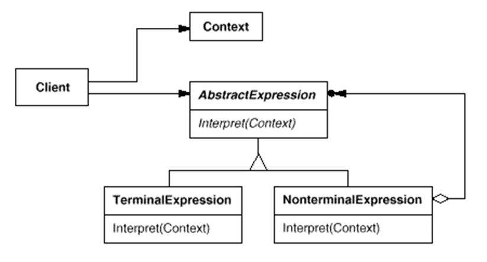

# Návrhové vzory

[TOC]

## Creational

---

### Factory Method

*Interface pro vytváření objektů bez specifikace přesné třídy.*

**Použití**

Místo konstruktoru voláme metodu (buď inherited z interface a nebo implementovanou v base a následně přepsanou)
Může to být statická metoda, ale pak je problém s overridem

Účastníci jsou `Product`/`ConcreteProduct` a `Creator`/`ConcreteCreartor` (deklarace/implementace)
Všechny produkty musí mít nějaký společný interface

**Když:** předem nevíme přesné třídy (switch za runtime), delegace (rozhodnutí i výroby) na podtřídu

Příklad s vytvářením mobilů... switch uvnitř

**Výhody a nevýhody**

* Rozšiřitelnost - odstranění vazby při vytváření, Single responsibility - ... , Open/Closed - přidávání nových produktů
* Hodně přidaných tříd a dědičností - velký kód

**Vztahy**

*Abstract factory* - často využívá factory metody
*Template method* - factory metoda je specializace *template method*
*Prototype* - podobné, ale *factory method* závisí na dědičnosti

**Přehled**

---

### Abstract Factory

*Třída s rozhraním pro vytváření určité skupiny tříd bez specifikování přesných třid*

**Použití**

Definujeme interface `AbstractFactory`, která nám dá objekt splňující rozhraní `Product` (tedy nějaký `ConcreteProduct`)
Po té implementujeme a inicializujeme konkrétní `Factory`

**Když:** by měl být systém nezávislý na vytváření objektů
Rodina určitých produktů je navržena tak, aby fungovali spolu

Příklad: Gui factory na OsX a Windows...

**Výhody a nevýhody**

* Zaručená kompatibilita produktů, Single Responsibility - vytváření, Open/Closed - přidávání nových
* Hodně nových interfaces a tříd

**Vztahy**

*Builder* - konstrukce step by step vs konstrukce podle druhu
*Factory Method* - slouží jako základ, dá se ale použít i *Prototype*
*Facade* - *Abstract Factory* je alternativa *Facade* pokud schováváme pouze vytváření

**Přehled**

---

### Builder

*Oddělení vytváření a použití, výroba probíhá po krocích*

...aby stejný konstrukční proces mohl nabídnout různé reprezentace

**Použití**

Vytvoření třídy, která `product` vytváří po krocích (opět `Concrete` a abstraktní `Builder`)
Volitelně proces vytváření řídí `Director ` - ten může mít i předvolby

**Když:** vytváření komplexních objektů je nezávislé na částech a jak jsou vytvořeny (kamenný a dřevěný dům)
Vyhnutí se teleskopickému konstruktoru (hodně volitelných parametrů)

Jednořádkové použití (postupné vs plynulé)
Dá se zajistit immutabilita pomocí *vybuildění* (`getResult()`)

Příklad se sendvičem...

Příklad v praxi: Kendo UI

**Výhody a nevýhody**

* ThreadSafe, defaultní hodnoty, rozšiřitelnost, zbavení se ošklivých konstrktorů
* Repetetivní kód a vyšší komplexita

**Vztahy**

*Abstract factory* - podoba
*Composite* - *builder* může tvořit objekty podle *composite*
*Bridge* - možné kombinovat
*Singleton* -  může implementovat

**Přehled**

---

### Prototype

*Vytváření instancí pomocí klonování*

...ne vždy je totiž možné kopírovat zvnějšku

**Použití**

Vytvoříme interface `Prototype` a potom `ConceretePrototypes`, které budeme klonovat

**Když:** systém je nezávislý na tom jak jsou objekty vytvářeny a jaké konkrétní třídy používáme
Specifikováno za runtime/vyhnutí se vytváření komplikované hierarchie/jenom pár různých kombinací

Dá se využít i katalog prototypů - `PrototypeManager`

Pozor na problém s shallow copy

Příklad ve hrách...

**Výhody a nevýhody**

* Pomůže s odstraněním duplicit inicializace velkých objektů, alternativa k dědičnosti
* Cirkulární reference, může být trochu overkill

**Vztahy**

*Abstract factory* - možnost implemetnace pomocí *prototype*
*Commands* - kopie do historie
*Memento* - *prototype* je lehčí alternativa
*Composite* a *Decorator* - mohou benefitovat

**Přehled**

---

### Singleton

*Zajištění pouze jediné globálně dostupné instance*

**Použití**

Třída která má zaručeně vždy jen jednu instanci a je k ní možný globální přístup
Defaultní konstruktor musí být private a statická get metoda...

Například v MVC...

**Když:** Části programu mají sdílený objekt

**Výhody a nevýhody**

* Jednoduché použití pokud není nutné řešit závislosti, zámky a destrukci objektů, inicializace včas...
* Porušení Single Reposonsibility, maskuje špatný návrh, více jader komplikované

**Vztahy**

*Abstract factory, builder, prototype, facade* - Může být implementováno *singletonem*

**Přehled**

---

## Structural

### Facade

*Jednotné rozhraní pro snadné použití subsystémů*

**Použití**

K nějakým `subsystems` si vytvoříme `facade` - tedy rozhraní, které pouze předá požadavek konkrétním subsystémům a potom nám vrátí výsledek

Pokud je příliš velké, tak je potřeba ho rozvrstvit

Klient ho ale nemusí být nucen použít

**Když:** zjednodušit komplexní ovládání subsystémů, například schování závislostí nebo zvrstvení

Příklad s kompilátorem...
Analogie s restaurací

**Výhody a nevýhody**

* Odstranění komplexnosti, počtu objektů o které se klient musí starat
* Pozor na god object

**Vztahy**

*Facade*, *Adapter*, *Proxy*, *Decorator* - ...
*Singleton* - implemntace...
*Abstract factory* - fasáda ale jakože jen pro výrobu
*Mediator* - subsystémy si jsou vědomy mediatoru a jinak nekomunikují

**Přehled**

---

### Proxy

> Also known as surrogate

*Substituce za objekt*

**Použití**

Vytvoření třídy se stejným rozhraním (`proxy`,`subject`, `realSubject`)

Různé účely - protection, caching, virtual, logging, remote...
Ale také smart reference pro mazání nepotřebných objektů

**Když:** chceme kontrolovat přístup, cachovat, lazy inicializovat, logování, ...

Příklad s autem...

**Výhody a nevýhody**

* Výkon, bezpečnost, bez zjištění klienta, O/C
* Rozšíření kódu, zpomalení odpovědi

**Vztahy**

*Adapter, Facade, Decorator* - ...

**Přehled**

---

### Adapter

> Also known as wrapper

*Umožní dvě nekompatibilní interfaces spolupracovat*

**Použití**

Vytvoření třídy `adapter` s rozhraním `adaptee` do které zabalím původní `target`
Dá se tak i přidat nová funkcionalita (pak velmi podobné decorator...)

Class adapter - vyžaduje mnohonásobnou dědičnost
Object adapter - implementuje jednu a druhou zabalí (libovolný jazyk)

**Když:** Potřeba použít existující objekt nebo něco přidat

Příklad s geometrickými tvary...

**Výhody a nevýhody**

* SRP - separace konverze a logika, O/C - snadné přidání nových adaptérů
* Přidaná komplexnost

**Vztahy**

*Bridge* - podobné, *bridge* se ale většinou připraví předem...
*Facade* - definuje nové rozhraní a pracuje s několika subsystémy
*Proxy* - zachovává rozhraní
*Decorator* - přidává rozhraní

**Přehled**

...případně:

---

### Bridge

> Also known as handle/body

*Umožní jednu třídu rozseknout na abstrakci a implementaci*

**Použití**

Příklad s kvádry a kužely, které můžou být červené nebo modré - oddělíme tvar od barvy

Abstakce by neměla dělat žádnou reálnou práci a pouze delegovat na implementaci

Rozseknutí monolitu nebo rozšíření tříd o nějakou dimenzi
Abstrakce a implementace jsou spojené "mostem", snazší managment změn

**Když:** je potřeba rozdělit velký monolit a vyhnout se harkódění implementace
Rozšíření třídy o nějakou dimenzi (bojovník, zbraň, vzhled)
Switchování implementace za runtime (hodně podobné strategy pattern)

Příklad s ovladačem a rádiem či televizí...

**Výhody a nevýhody**

* SRP, O/C - představení nových nezávisle, Platform independent apps, schování technických detailů
* Přidání kódu

**Vztahy**

*Adapter* - ...
*State*, *Strategy* - všechny delegují problémy na jinou třídu, ale za jiných situací 
*Abstract factory* - umí vytvořit nějaký konkrétní *bridge*

**Přehled**

---

### Composite

*Převedení objektů na stromovité struktury (složených a základních)*

**Použití**

Máme dva druhy tříd - list a kompozit
Umožní nám to dát do stromové struktury - viz příklad s krabicí a produkty

Kde ale definovat operace - komponenta vs komposit... každé svoje výhody

**Když:** je potřeba implementovat stromovou strukturu, je potřeba využít komplexní a jednoduché objekty stejně

Rekurzivní operace

**Výhody a nevýhody**

* Jednotný a snadný interface, O/C snadno rozšiřitelný
* Problém s implementací operací pro děti, velké zobecnění

**Vztahy**

*Builder* - na postavení
*Iterator* - na průchod
*Visitor* - na operace
*Flyweight* - na uložení nodes
*Chain of responsibility* - spolu

**Přehled**

---

### Decorator

> Also known as Wrapper

*Přidání nových vlastností zabalením třídy*

**Použití**

Využití agreagace a kompozice místo dědičnosti

Wrapper zabalí třídu - klidně opakovaně, má stejný interface

**Když:** přidávání dovedností za runtime nebo dědičnost je divná (viz příklad notifikace)

Příklad s vaflemi

**Výhody a nevýhody**

* Rozšíření objektů bez podtříd, kombinace objektů, SRP - rozdělení monolitu
* Často závislé na pořadí, konfigurace je ošklivá, mnoho malých tříd, zpomalení

**Vztahy**

* *Adaptér* - mění rozhraní, *Proxy* - zachovává, *Decorator* - zachovává a přidává
* *Chain of Resp* - podobná struktura, CoR ale nezávislé operace
* *Composite* - kdyby byl unární strom a nepřidával nové věci
* *Strategy* - mění vnitřek...

**Přehled**

---

### Flyweight

*Změnší množství dat při mnoho objektech sdílením společného*

**Použití**

Sdílení společného pomocí kešované reference

Musí se zajistiti imutabilita objektu
Hodí se vyrábět továrnou

**Když:** má aplikace velké množství objektů, hodně stavů může být reprezentovaných vně, identita není důležitá

Příklad se střely ve hře či znaky v editoru

**Výhody a nevýhody**

* Ušetřená RAM
* Zpomalení CPU, komplikovaný kód

**Vztahy**

*Composite* - využití flyweight k ušetření RAM
*Singleton* - podoba

**Přehled**

---

## Behavioral

### State

*Změna chování objektu při změně stavu*

**Použití**

Current state se dá konstruktoru, každý stav explicitně specifikuje přechod mezi stavy
Blízko konceptu konečných automatů

Stavy by měly být nested v contextu

**Když:** často se mění stav, mnoho if podmínek, které mění chování podle stavu, ...

Analogie s telefonem - odemčený, ...
Příklad s grafickým editorem a nástroji

**Výhody a nevýhody**

* SRP - stavy odpovídají třídám, O/C - snadné přidávání stavů, simplifikace a odstranění mohutných podmínek
* Can be overkill

**Vztahy**

*Bridge, State, Strategy* - delegace práce na ostatní objekty (state je jen rozšíření *strategy*)

**Přehled**

---

### Memento

*Ukládání stavu bez odhalení detailů*

**Použití**

Přidáme do `originator` třídy funkci `GetSnapshot() `a následně `restore(memento ...)`
Možný `caretaker` pro správu a ukládání snapshotů (nikdy s nimi nepracuje)

Wide a narrow interface

**Když:** potřebujeme uložit snapsahot při jinak porušení enkapsulace

*Příklad* s editorem

**Výhody a nevýhody**

* Máme snapshoty
* Hodně RAM, lifecycle na odstranění mement, ...

**Vztahy**

*Command* - dohromady pro undos
*Iterator* - dohromady pro přesnější state
*Prototype* - může být snazší

**Přehled**

---

### Iterator

*Průchod kolekcí bez odhalení implementace*

**Použití**

`GetIterator()` a následně `GetNext()` (dokud `hasMore()`)

Verze tzv. kurusoru spravovaná kolekcí

**Když:** procházet komplexní datové struktury bez odhalení implementace a případně je měnit za runtime
odstranit duplicity při procházení

Příklad třeba se stromem...

**Výhody a nevýhody**

* SRP, O/C, paralelní iterace, odložení
* Může být overkill, less efficient v některých případech

**Vztahy**

*Composite* - prochází se iterátorem
*Factory method* - na výrobu
*Memento* - spolu...
*Visitor* - spolu...

**Přehled**

---

### Command

*Požadavek jako jednoduchý objekt*

**Použití**

Interface `command`, které zajistí metodu `execute()`
Commands by měl vytvářet příjemce a sender by je měl spouštět

**Když:** Operace jako objekt, který lze parametrizovat
Fronta operací s opožděným provedením
Vracení operací

*Příklad* s buttons a přidělení jejich commands...

**Výhody a nevýhody**

* SRP - Oddělení tříd na provedení operací, OC - přidání nových, undo, fronta
* Komplikace kódu

**Vztahy**

*CoR, Mediator, Observer* - spojení odesílatelů a přijímačů
*CoR* - implementace pomocí commandů
*Memento* - spolu pro undos
*Strategy* - podobný
*Prototype* - ukládání kopie

**Přehled**

---

### Interpreter

*Problémy které lze vyjádřit v reálném jazyce, které interpretujeme*

**Použití**

Máme problém, který lze vyjádřit větami
Řešení - ten jazyk interpretujeme

`Terminal` and `NoneTerminal` expression, které mají `Interpret`

Příklad gramatika regulárního jazyka či postfix kalkulačka

Neobsahuje parser pro konstrukci

**Výhody a nevýhody**

* Gramatiky bývají lehce rozšiřitelné a implementovatelné
* Složitější jsou velmi nepřehlendé

**Vztahy**

*Composite* - implementace composite
*Visitor* - operace na datech stromu
*Iterator* - procházení
*Flyweight* - vyhodnocení v compile time

**Přehled**

...

---

### Chain of Responsibility

*Řetěz handlerů pro request*

**Použití**

Odešleme požadavek a někdo ho zpracuje

**Když:** různé requesty, ale stejné předem dané pořadí
Změna handlerů za běhu

Příklad s vrstvenou architekturou, která může odmítnout - počítání mincí

**Výhody a nevýhody**

* Kontrola pořadí, SPR - rozdělení zpracování a provádění, OC - přidání nových handlerů
* Něco se nemusí vyřídit

**Vztahy**

*Command, mediator, observer* - spojují odesilatele a přijemce
*Composite* - průchod z listu do kořene
*Commands* - implementace pomocí
*Decorator* - podobná struktura

**Přehled**

---

### Observer

*Způsob jak notifikovat objekty*

**Použití**

Publisher calls subscribers, kteří si o notifikaci zažádali

**Když:** Změna jednoho vyvolá změnu jiných
Když se musí řídit jiným jen po určitý čas

Analogie se zákazníků obchodu

**Výhody a nevýhody**

* OC, Nové vztahy za runtime
* Random notifikace

**Vztahy**

*CoR, Mediator, Command* - spojení odesílatelů a přijímačů
*Mediator* - podobný

**Přehled**

---

### Mediator

*Omezí chaotické závislosti*

**Použití**

Komponenty spolu nekomunikují přímo - využijí mediator

**Když:** hodně tříd je úzce spjatých a jsou náročné na změnu
Náročné znovu použít některé komponenty
Mnoho subclasses pro změny v určitých případech

Měnící se formulář - udělat komponenty nezávislé

**Výhody a nevýhody**

* SRP - komunikace, OC - přidání kompoentn, méně spojeného
* God object

**Vztahy**

*CoR* - sekvenční komunikace
*Command* - nepřímá komunikace
*Facade* - organizace (subsytém ale o fasádě neví)
*Observer* - může zuršit odběr

**Přehled**

---

### Strategy

*Obalení algoritmu do třídy*

**Použití**

Extrakce algoritmu do třídy
Původní třída (context) má referenci na aktuální strategii
Strategii vybírá klient

**Když:** různé varianty algoritmů za runtime
Podobné třídy s drobnými změny exekuce
Izolace business logiky a implementace
Obří switch

Příklad s různými způsoby dopravy

**Výhody a nevýhody**

* Změna algoritmu za běhu, izolace implementace, OC - přidávání nových algoritmů
* Když je jen pár algoritmů, klienti musí znát rozdíly, dnes máme anonymní funkce

**Vztahy**

*Brdige, State* - delegace práce na ostatní
*Command* - rozdílný úmysl
*Template method* - ...
*State* - extenze strategie, navíc se stavy

**Přehled**

---

### Template Method

*Definuje skeleton algoritmu, ale nechá podtřídy specifikovat*

**Použití**

Máme nějaký algoritmus s kroky, které necháme na potomcích

**Když** klient má rozšířit algoritmus
Mnoho tříd skoro stejných

Příklad se sbírkou, nápoji a platební bránou

**Výhody a nevýhody**

* Klienti můžou upravit algoritmus, odstranění duplicit
* Limitace klientů, nesouvislost algoritmu

**Vztahy**

*Factory method* - je specializace
*Strategy* - podobné

**Přehled**

---

### Visitor

*Umožní oddělení algoritmů a objektů*

**Použití**

Vrcholy nějaké komplexní struktury mají metodu `accept()` pro každého možného návštěvníka

Visitor má vždycky `VisitOn(...)`
A pak navštívíme všechny vrcholy...

**Když:** operace na elementech komplexní struktury
Pročistit business logiku
Když chování dává smysl jen u některých tříd hierarchie

Příklad s stromem aritmetického výrazu

**Výhody a nevýhody**

* OC - dá se přidat nové chování, SRP - chování v oddělené třídě
* Potřeba update všech visitorů při přidání třídy

**Vztahy**

*Command* - slabší verze
*Composite* - spolu
*Iterator* - spolu

**Přehled**

