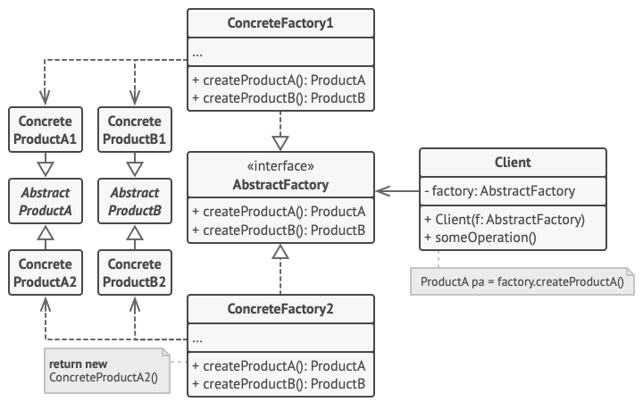
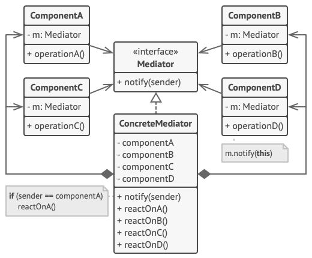

# Návrhové vzory

[TOC]

## Creational

---

### Factory Method

*Interface pro vytváření objektů*

**Použití**

Virtuální funkce místo `new`
Máme třídy `Product`/`ConcreteProduct` a `Creator`/`ConcreteCreartor` (deklarace/implementace)

Příklad s vytvářením mobilů

Není špatné, když je to statická metoda

**Výhody a nevýhody**

* Rozšiřitelnost - odstranění vazby při vytváření, Single responsibility - ... , Open/Closed - přidávání nových produktů
* Hodně přidaných tříd a dědičností

**Vztahy**

*Abstract factory* - využívá factory metody
*Template method* - factory metoda je specializace *template method*
*Prototype* - podobné, ale *factory method* závisí na dědičnosti

**Přehled**

---

### Abstract Factory

*Třída s rozhraním pro vytváření určité skupiny tříd*

**Použití**

Definujeme rozhraní třídy, která nám dá objekt určitého druhu

Potřebujeme dále `Product` interfaces určitých typů s `ConcreteProducts` a pak implementujeme a inicializujeme konkrétní `Factory`

**Výhody a nevýhody**

* Zaručená kompatibilita produktů, Single Responsibility, Open/Closed
* Hodně nových interfaces a tříd

**Vztahy**

*Builder* - konstrukce step by step vs konstrukce podle druhu
*Factory Method* - slouží jako základ, dá se ale použít i *Prototype*
*Facade* - *Abstract Factory* je alternativa *Facade* pokud schováváme pouze vytváření

**Přehled**

---

### Builder

*Oddělení vytváření a použití*

**Použití**

Vytvoření třídy, která `product` vytváří po krocích (opět `Concrete` a abstraktní `Builder`)
Proces vytváření řídí `Director ` - ten má předvolby

Příklad se sendvičem, jednořádkové použití (postupné vs plynulé)

Dá se zajistit immutabilita pomocí vybuildění

Hodí se když je dost parametrů volitelných

**Výhody a nevýhody**

* ThreadSafe, defaultní hodnoty, rozšiřitelnost, zbavení se ošklivých konstrktorů
* Repetetivní kód

**Vztahy**

...
*Composite* - *builder* může tvořit objekty podle *composite*
*Bridge* - možné kombinovat
*Singleton* -  může implementovat

**Přehled**

---

### Prototype

*Snadné klonování instancí*

**Použití**

Ne vždy je možné kopírovat zvnějšku
Přidáme tedy objektu možnost se naklonovat

Hodí se to pokud vyloženě nezávisí na třídách se kterými pracujeme

Dá se využít i katalog prototypů

**Výhody a nevýhody**

* Pomůže s odstraněním duplicit inicializace velkých objektů, alternativa k dědičnosti
* Cirkulární reference, trochu overkill

**Vztahy**

*Abstract factory* - možnost implemetnace pomocí *prototypu*
*Commands* - kopie do historie
*Memento* - *prototype* je lehčí alternativa

**Přehled**

---

### Singleton

*Pouze jedna instance*

**Použití**

Třída která má vždy jen jednu instanci a je k ní možný globální přístup
Defaultní konstruktor musí být private

Kontrola nad globálními proměnými

**Výhody a nevýhody**

* Jednoduché použití pokud není nutné řešit závislosti, zámky, destrukci objektů, ...
* Porušení Single Reposonsibility, maskuje špatný návrh, více jader komplikované

**Vztahy**

*Facade* - Může implementovat *singletonem*
*Flyweight* - Podobné, ale dva rozdíly
*Abstract factories, builders, prototypes* - Může implementovat *singletonem*

**Přehled**

---

## Structural

### Facade

*Rozhraní pro snadné použití subsystémů*

**Použití**

Vytvoření zjednodušeného interface do subsystémů

Možné vrstvit

Klient ho nemusí být nucen použít

**Výhody a nevýhody**

* Odstranění komplexnosti
* Pozor na god object

**Vztahy**

*Facade*, *Adapter*, *Proxy*, *Decorator* - ...
*Singleton* - ...
*Abstract factory* - fasáda jen pro výrobu
*Mediator* - subsystém si je vědom mediatoru a jinak nekomunikuje

**Přehled**

---

### Proxy

*Substituce za objekt*

**Použití**

Vytvoření třídy se stejným rozhraním

Umožní nám například kontrolovat přístup, cachovat, lazy inicializovat, logování, ...

**Výhody a nevýhody**

* Bez zjištění klienta ovládat či měnit lifecycle, O/C
* Rozšíření kódu, zpomalení odpovědi

**Vztahy**

*Adapter, Decorator* - ...
*Facade* - ta ale rozhraní mění

**Přehled**

---

### Adapter

*Umožní dvě nekompatibilní interfaces spolupracovat*

**Použití**

Vytvoření třídy do které zabalím původní a má metody, které potřebuji

Dá se tak i přidat nová funkcionalita...

**Výhody a nevýhody**

* SRP - separace konverze a logika, O/C
* Komplexnost

**Vztahy**

*Bridge* - podobné, ten se ale většinou připraví předem
*Facade* - definuje nové a pracuje s několika subsystémy
*Proxy* - zachovává rozhraní
*Decorator* - pouze přidává a nemění

**Přehled**

---

### Bridge

*Umožní jednu třídu rozseknout na dvě spojené*

**Použití**

Příklad s kvádry a kužely, které můžou být červené nebo modré - oddělení tvaru od barvy

Rozseknutí monolitu nebo rozšíření tříd o nějakou dimenzi
Abstrakce a implementace jsou spojené mostem, snazší managment změn

Switchování za runtime - hodně podobné strategy pattern

**Výhody a nevýhody**

* SRP, O/C, Platform independent apps
* Přidání kódu

**Vztahy**

*Adaptér* - bridge na dvě existující
*State*, *Strategy* - všechny delegují problémy na jinou třídu, ale za jiných situací 
*Abstract factory* - pokud je ve *factory* potřeba něco dependant na implementaci

**Přehled**

---

### Composite

*Převedení objektů na stromovité struktury složených a základních*

**Použití**

Máme dva druhy tříd - list a kompozit

Umožní nám to dát do stromové struktury - viz příklad s krabicí

Rekurzivní operace

**Výhody a nevýhody**

* Jednotný a snadný interface, O/C snadno rozšiřitelný
* Problém s implementací operací pro děti, velké zobecnění

**Vztahy**

*Builder* - na postavení
*Iterator* - na průchod
*Visitor* - na operace
*Flyweight* - na uložení nodes
*Chain of responsibility* - spolu často

**Přehled**

---

### Decorator

*Přidání nových vlastností zabalením třídy*

**Použití**

Využití agreagace a kompozice místo dědičnosti

Wrapper zabalí třídu - opakovaně, má stejný interface

Dá se použít na přidání dovedností za běhu a nebo když je dědičnost divná (příklad notifikace)

**Výhody a nevýhody**

* Rozšíření objektů bez podtříd, kombinace objektů, SRP
* Často závislé na pořadí, konfigurace je ošklivá

**Vztahy**

* *Adaptér* - mění rozhraní, *Proxy* - zachovává, *Decorator* - zachovává a přidává
* *Chain of Resp* - podobná struktura, CoR ale nezávislé operace
* *Composite* - kdyby byl unární strom a nepřidával nové věci
* *Strategy* - mění vnitřek

**Přehled**

---

### Flyweight

*Změnší množství dat při mnoho objektech sdílením společného*

**Použití**

Sdílení společné

Příklad se střely ve hře

Musí se zajistiti imutabilita

**Výhody a nevýhody**

* Ušetřená RAM
* Zpomalení CPU, komplikovaný kód

**Vztahy**

*Composite* - ...
*Singleton* - ...

**Přehled**

---

## Behavioral

### State

*Změna chování objektu při změně stavu*

**Použití**

Přechody mezi stavy, current state...

Analogie s telefonem - odemčený, ...

**Výhody a nevýhody**

* SRP, O/C, Simplify
* Can be overkill

**Vztahy**

*Bridge, State, Strategy* - ... extension of strategy

**Přehled**

---

### Memento

*Ukládání stavu bez odhalení detailů*

**Použití**

Přidáme dovnitř třídy funkci `GetSnapshot()`
Možný caretaker

**Když:** potřebujeme uložit snapsahot při jinak porušení enkapsulace

*Příklad* s editorem

**Výhody a nevýhody**

* Máme snapshoty
* Hodně RAM, lifecycle na odstranění mement, ...

**Vztahy**

*Command* - dohromady pro undos
*Iterator* - dohromady pro přesnější state
*Prototype* - může být snazší

**Přehled**

---

### Iterator

*Průchod kolekcí bez odhalení implementace*

**Použití**

`GetIterator()` a následně `GetNext()`

**Když:** komplexní datové struktury
odstranit duplicity při procházení
procházení různých datových struktur

**Výhody a nevýhody**

* SRP, O/C, paralelní iterace, ...
* Může být overkill, less efficient

**Vztahy**

*Composite* - průchod iterátorem
*Factory method* - na výrobu
*Memento* - spolu...
*Visitor* - spolu...

**Přehled**

---

### Command

*Změní požadavek v jednoduchý objekt*

**Použití**

Operace jako objekt
Fronta operací
Vracení operací

*Příklad* s buttons

**Výhody a nevýhody**

* SRP, OC, Undo, fronta, komplexní
* Komplikace

**Vztahy**

*CoR, Mediator, Observer* - spojení odesílatelů a přijímačů
*CoR* - implementace pomocí commandů
*Memento* - spolu pro undos
*Strategy* - podobný
*Prototype* - ukládání kopie

**Přehled**

---

### Interpreter

*Problémy které lze vyjádřit v reálném jazyce, které interpretujeme*

**Použití**

**Výhody a nevýhody**

**Vztahy**

**Přehled**

...

---

### Chain of Responsibility

*Řetěz handlerů pro request*

**Použití**

**Když:** různé requesty, ale stejné předem dané pořadí
Změna handlerů za běhu

GUI

**Výhody a nevýhody**

* Kontrola pořadí, SPR, OC
* Něco se nemusí vyřídit

**Vztahy**

*Command, mediator, observer* - ...
*Composite* - průchod z listu do kořene
*Commands* - implementace pomocí
*Decorator* - podobná struktura

**Přehled**

---

### Observer

*Způsob jak notifikovat objekty*

**Použití**

Notifikace zákazníků o produktu

Publisher a subscribers
Pub. calls notifers

**Když:** Změna jednoho vyvolá změnu jiných
Když se musí řídit jiným jen po určitý čas

**Výhody a nevýhody**

* OC, Nové vztahy za runtime
* Random notifikace

**Vztahy**

*CoR, Mediator, Command* - spojení odesílatelů a přijímačů
*Mediator* - podobný

**Přehled**

---

### Mediator

*Omezí chaotické závislosti*

**Použití**

Měnící se formulář - udělat komponenty nezávislé

Compoenty a mediator

**Když:** hodně tříd je úzce spjatých a jsou náročné na změnu
Náročné znovu použít některé komponenty
Mnoho subclasses pro změny v určitých případech

**Výhody a nevýhody**

* SRP, OC, méně spojeného
* God object

**Vztahy**

*CoR, Command, Observer* - ...
*Mediator* - organizace (subsytém ale o fasádě neví)
*Observer* - ...

**Přehled**

---

### Strategy

*Obalení algoritmu do třídy*

**Použití**

Mapy s různými způsoby dopravy

**Když:** různé varianty algoritmů za runtime
Podobné třídy s drobnými změny exekuce
Izolace business logiky a implementace
Obří switch

**Výhody a nevýhody**

* Změna algoritmu za běhu, izolace implementace, OC
* Pár algoritmů se komplikje, klientni musí znát rozdíly

**Vztahy**

*Brdige, State* - delegace práce na ostatní
*Command* - rozdílný úmysl
*Template method* - ...
*State* - extenze strategie, navíc se stavy

**Přehled**

---

### Template Method

*Definuje skeleton algoritmu, ale nechá podtřídy specifikovat*

**Použití**

**Když** klient má rozšířit algoritmus
Mnoho tříd skoro stejných

**Výhody a nevýhody**

* Klienti můžou upravit algoritmus, duplicit se dá nahoru
* Liskov substitution, limitace klientů

**Vztahy**

*Factory method* - je specializace
*Strategy* - podobné

**Přehled**

---

### Visitor

*Umožní oddělení algoritmů a objektů*

**Použití**

**Když:** operace na elementech komplexní struktury
Pročistit business logiku
Když chování dává smysl jen u některých tříd hierarchie

**Výhody a nevýhody**

* OC, SRP, 
* Potřeba update všech visitorů při přidání třídy

**Vztahy**

*Command* - slabší verze
*Composite* - spolu
*Iterator* - spolu

**Přehled**

