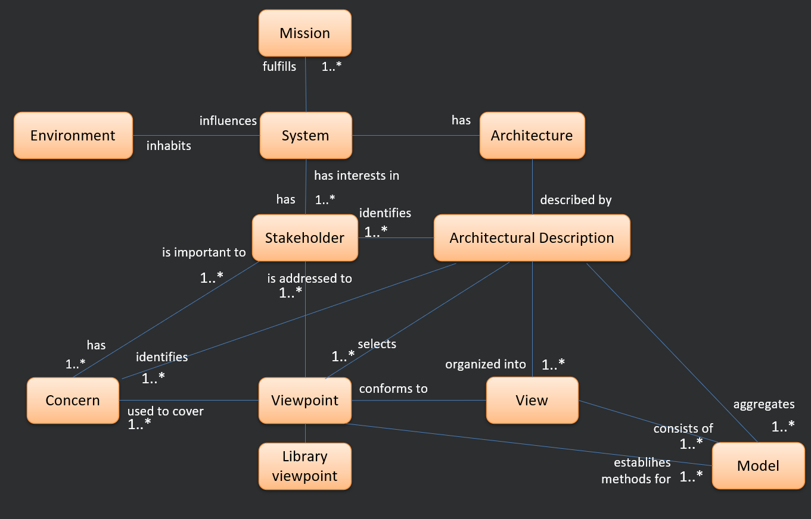
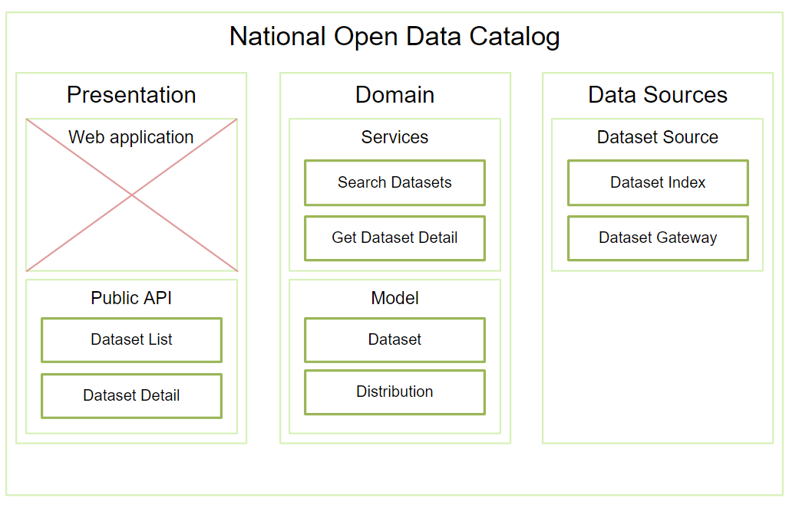
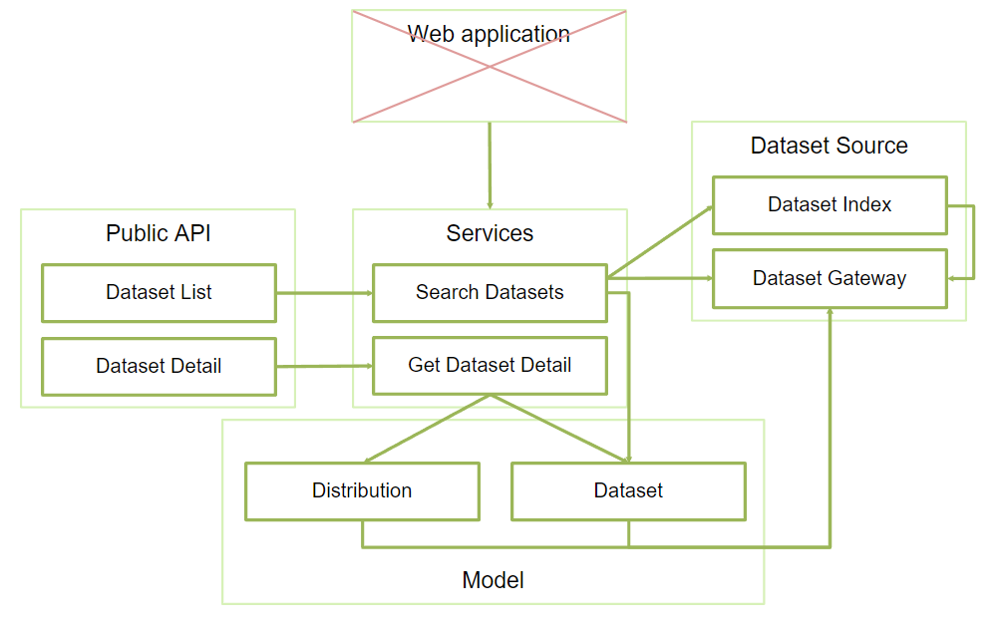
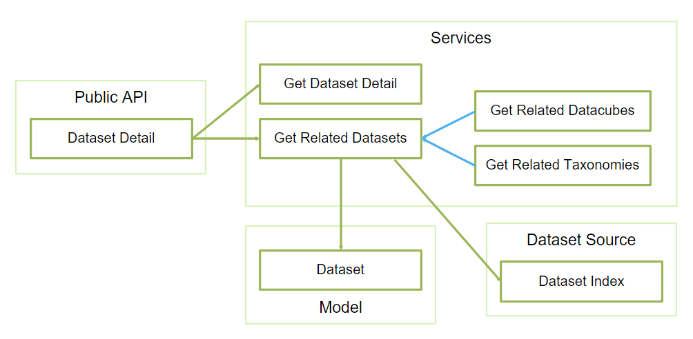
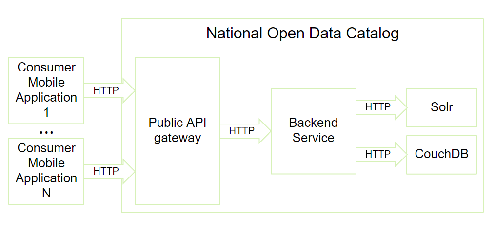
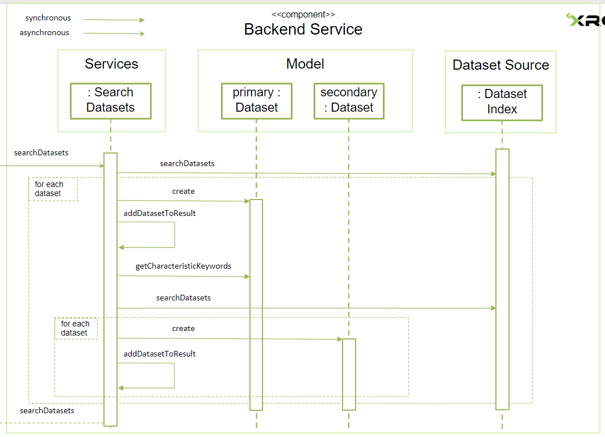

# Software architecture

*29.09.2022 - lecture01, lecture02*

Running example - the Czech National Open Data Catalogue. 
Open data follows the 5-star deployment scheme, which includes five levels of increasing openness and reuse...

Software architecture - set of structures needed to reason about the system. It comprise software elements and their relations (including properties). Good architecture can make a system more maintainable, scalable, and adaptable to change.

Architectural structures:

* **Modules (static)** - units of code that have specific responsibilities and are developed and managed by individual people or teams.

* **Components (dynamic)** - instances of modules or sets of related modules that exist at runtime and interact with each other to perform the required functions of the system.

* **Allocation** structures are also a part of software architecture and describe the mapping of software structures to their environments, such as the mapping of modules to developers or components to physical infrastructure.

### Layered architecture

Way of organizing the components of a software system into layers, where each layer serves a specific purpose and communicates with the layers directly above and below it.

- **Presentation layer** is responsible for handling the user interface and presenting data to the user. It communicates with the domain layer to request data and with the user to receive input.

- **Data source layer** is responsible for communicating with external data sources and transforming the data into a form that can be used by the rest of the system.

- **Domain layer** is responsible for implementing the business logic of the system, such as input validation, calculations, and decisions about which data to retrieve from the data source layer. It communicates with the presentation layer to provide data for display and with the data source layer to request data from external sources.

*More on that in the last lecture on architectural patterns.*

## Basic terminology

*IEEE 1471* considers different kinds of software systems such as applications, platforms, systems of systems, enterprise systems, and product lines. Also different contexts in which a software system may exist or be used such as developmental, operational, business, and technological contexts.

### Vocabulary

* A `software system` is a collection of components that work together to achieve a `mission` as defined by the organization that owns or uses the system. 

* The `environment` includes the organization and its surroundings, such as partners, legislation, and customers. People in this `environment` are generally called `stakeholders` and they are individuals or groups that have an interest in or are affected by the software system.

* `Concerns` are the issues or factors that must be addressed when designing and evolving a `software system`. 

* `Quality attributes` are the non-functional characteristics of a software system that are important to its stakeholders. 

* `Views` are different ways of looking at a software system, each with its own perspective and purpose.

### Diagram

## Viewpoints - Module, Component and connector

*06.10.2022 - lecture03, lecture04, lecture05* 

An architectural view is a part of an architectural description that covers certain concerns of certain stakeholders. It defines kinds of elements and relationships, and rules to use them, and is usually informal and not explicitly expressed. 

To improve the readability of architectural views, we can use a standardized graphical notation, such as UML diagrams...

## Bass, Clemens and Kazman

They distinguish three basic architectural viewpoints: module, component and deployment. 

* The **module** viewpoint answers the question of how the system is structured as a set of code units and considers the modularization of the system into cohesive and loosely coupled units. It Is important for communication and also servers as a blueprint for the code construction. 

* The **component** viewpoint answers the question of how the system is structured as a set of deployable units and what are their relationships.

* The **deployment** viewpoint answers the question of how the system is deployed on a specific platform, and considers the physical deployment of the system.

### Module viewpoint

Each module has properties such as name, visibility, functional responsibilities...

#### Decomposition viewpoint

Decomposing until we have small enough modules 

*The modules doesn't have to be 1:1 to source code*

#### Usage viewpoint

Which module needs what (with relations - calls, uses, depends and is allowed)

#### Class viewpoint

Based on similarities

### Component-and-connector viewpoint

Based on the question "What are the major executing components and how do they interact through which interaction pathways?"

* **Components** are the principal units of computation and represent the runtime behavior of the software system. They can be services, their clients, peers, processes, threads, objects, data stores...

* **Connectors** are the communication vehicles among components and represent some interaction between components at runtime. Kinds of connectors range from simple call-return communication primitives to complex network connectors.

This approach helps with availability, performance, security, ...

Mapping components to modules isn't 1:1 either - components can map to single module, multiple modules or they don't have to be mapped at all.

**Sequence diagram** is just interaction between components ordered in time.

### Allocation viewpoint

* Deployment - c&c and hardware 

* Implementation - modules and files

* Work assignment - modules and people

## C4 model diagrams and architecture documentation

*13.10.2022 - lecture-practice01, lecture-practice02*

* System - delivers value to user

* Container - represents context (application, service, database. ...)

* Components - group of related functionality with interface

* Code - building blocks

---

# Quality attributes

*20.10.2022 - lecture-practice02, lecture08*

There are functional requirements, quality requirements and constraints.

A quality attribute is a measurable or testable property of a system that is used to indicate how well the system satisfies a quality requirement of a stakeholder. They  obviously don't depend solely on architecture as algorithms, UI design and so are also essential.

### Classification

* System
  
  * Run-time - performance, availability, ...
  
  * Design-time - modifiability, testability, ...

* Business - time to market, cost, ...

* Architectural - correctness, completeness, ...

### Requirement scenario

A scenario starts with a **stimulus**, it is a condition that requires a response when it arrives at a system. A **source of stimulus** is some entity (a human, a computer system, or any other actuator) that generated the stimulus. The stimulus stimulates an **artifact**, this may be the whole system, or some piece or pieces of it. And the stimulus occurs under certain conditions.

## Availability

*27.10.2022 - lecture09*

> Reliability of the system or its part and its ability to recover from faults

**Failure** - system no longer delivers the service

**Fault** - not observable fault

* Recovery - keep from becoming failure

* Repair - modify the system

Faults needs to be masked or repaired, tactics are detect, recover and prevent.

Detection - ping. heartbeat, time stamps, ...

* Active redundancy (components perform the same task). passive redundancy (one performs and informs others), cold spare (out of service until fault)

* Rollback, saga - just transactions

* Retry, ignore, degrade, reconfigure

Reintroduce - shadow, resynchronization, restart

## Modifiability

*03.11.2022 - lecture10*

Modify function, platform, sources, qualities, ...

Questions - What? How likely? When? Who? How much?

Responsibility 

Coupling (modules' overlap), cohesion (parts belongs together)
Dependencies (quality and existence)

**Reduce coupling** - restrict dependencies, encapsulate

Translator - anticorruption, open host, broker...

## Performance

*10.11.2022 - lecture11, lecture12, lecture13*

> How long to respond (usually set some time-based constraint)

**Solutions**

* Sampling rate, limit responses, prioritize events, bound execution time

* Improve algorithms, architecture, ... - performance/modifiability trade-off

* Increase resources, introduce concurrency, ...

## Scalability

> Ability to handle tasks as the system grows - users, data, features... (ideally with its quality attributes)

Load balancer, router, logic split

## Security

> Ability to protect data against attacks - confidentiality, integrity and availability

Authentication, authorization, nonrepudiation

Detect attacks, resist attacks and recovery

## Interoperability

*24.11.2022 - lecture14, lecture15, lecture16*

> How much can two systems exchange information

Technical - network protocol
Syntactic - structural patterns
Semantic - meaning and interpretation of the data

HTTP + REST, broker, ...

## Testability

> Ease to demonstrate software faults

Its based on ability to control each component's inputs and observe it outputs

Use of specialized interfaces, record/playback, local state storage, sandbox

Limit complexity

## Usability

> How easy is to accomplish a task

...

---

# Practical stuff

## C4 model - quality attributes

*01.12.2022 - lecture-practice03*

...

## Archimate

*08.12.2022 - KOMIX*

 ...

## Docker, Swarm, Kubernetes

*15.12.2022 - lecture18*

 Containers...

## Patterns, Domain-driven architecture

*22.12.2022 - lecture17*

Similar to design pattern (no clear boundary)

Router, broker, load balancer, API, ...

Layer pattern - splitting into layers

Domain driven design - separate technical problems from the domain (layers - domain, application, persistence, API, ...)

Three tier - application, data, presentation
